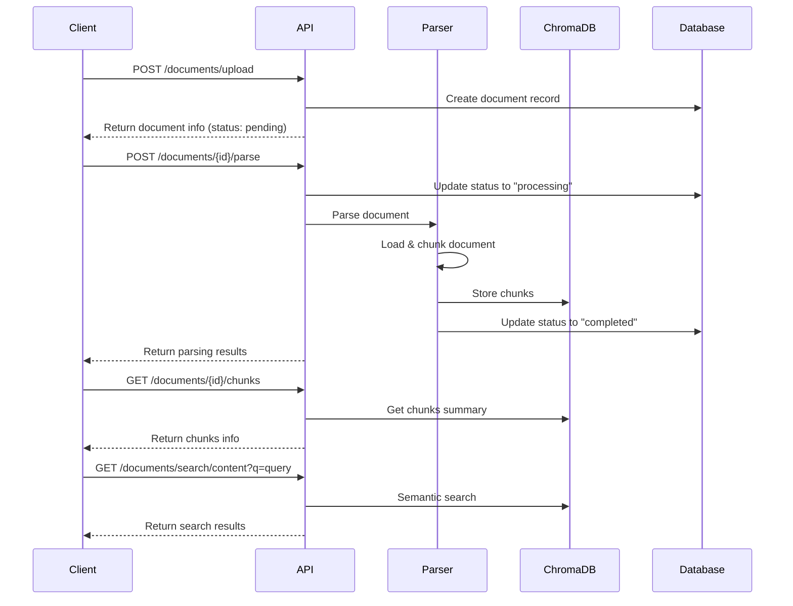

# Document Parsing API Documentation

## Overview

The Document Parsing API provides endpoints for parsing uploaded documents into semantic chunks and storing them in ChromaDB for semantic search. This enables question generation from document content.

## Endpoints

### 1. Parse Document

**POST** `/documents/{document_id}/parse`

Parse a previously uploaded document and extract semantic chunks.

#### Parameters
- `document_id` (path): ID of the document to parse

#### Authentication
- Requires valid Clerk JWT token

#### Response
```json
{
  "success": true,
  "document_id": 123,
  "total_chunks": 15,
  "total_characters": 8543,
  "file_type": ".pdf",
  "chunks_preview": [
    {
      "text": "Introduction to Machine Learning...",
      "metadata": {
        "filename": "ml_basics.pdf",
        "user_id": "user_123",
        "chunk_index": 0,
        "word_count": 156,
        "character_count": 892
      },
      "page_number": 1
    }
  ]
}
```

#### Error Responses
- `404`: Document not found
- `400`: Document already parsed
- `500`: Parsing failed

---

### 2. Get Document Chunks

**GET** `/documents/{document_id}/chunks`

Get summary of chunks for a parsed document.

#### Parameters
- `document_id` (path): ID of the document

#### Authentication
- Requires valid Clerk JWT token

#### Response
```json
{
  "document_id": 123,
  "total_chunks": 15,
  "total_characters": 8543,
  "total_words": 1429,
  "chunk_preview": [
    {
      "chunk_id": "doc_123_chunk_0_a1b2c3d4",
      "text_preview": "Introduction to Machine Learning. Machine learning is a subset...",
      "word_count": 156,
      "page_number": 1
    }
  ]
}
```

---

### 3. Search Document Content

**GET** `/documents/search/content`

Perform semantic search across document content using ChromaDB.

#### Query Parameters
- `q` (required): Search query string
- `document_id` (optional): Search within specific document
- `limit` (optional): Number of results (1-20, default: 5)

#### Authentication
- Requires valid Clerk JWT token

#### Response
```json
{
  "query": "machine learning algorithms",
  "document_id": null,
  "total_results": 3,
  "results": [
    {
      "chunk_id": "doc_123_chunk_5_e5f6g7h8",
      "text": "Supervised learning algorithms use labeled training data...",
      "similarity_score": 0.89,
      "document_id": 123,
      "filename": "ml_basics.pdf",
      "page_number": 3,
      "word_count": 142
    }
  ]
}
```

---

### 4. Get LLM-Ready Chunks

**GET** `/documents/{document_id}/llm-ready-chunks`

Get document chunks with embeddings optimized for LLM question generation.

#### Parameters
- `document_id` (path): ID of the document
- `question_context` (query, optional): Context for question generation
- `max_chunks` (query, optional): Maximum chunks to return (1-20, default: 10)

#### Authentication
- Requires valid Clerk JWT token

#### Response
```json
{
  "document_id": 123,
  "question_context": "generate educational questions",
  "total_chunks": 5,
  "chunks": [
    {
      "chunk_id": "doc_123_chunk_0_a1b2c3d4",
      "text": "Photosynthesis is the process by which plants convert sunlight...",
      "embedding": [0.123, -0.456, 0.789, ...],
      "embedding_model": "qa-optimized",
      "metadata": {
        "document_id": 123,
        "filename": "biology_basics.pdf",
        "page_number": 1,
        "word_count": 156,
        "character_count": 892,
        "question_generation_score": 0.85,
        "similarity_to_context": 0.72
      },
      "llm_context": {
        "suitable_for_questions": true,
        "complexity_level": "intermediate",
        "suggested_question_types": ["definition", "process", "multiple_choice"],
        "bloom_taxonomy_levels": ["remember", "understand", "apply"]
      }
    }
  ],
  "embedding_info": {
    "available_models": {
      "qa-optimized": {
        "type": "sentence-transformer",
        "local": true,
        "dimension": 384,
        "description": "Local sentence transformer model"
      }
    },
    "default_model": "qa-optimized"
  }
}
```

---

### 5. Get All LLM-Ready Chunks

**GET** `/documents/llm-ready-chunks/all`

Get chunks from all user documents optimized for LLM question generation.

#### Query Parameters
- `question_context` (optional): Context for question generation
- `max_chunks` (optional): Maximum chunks to return (1-50, default: 20)

#### Authentication
- Requires valid Clerk JWT token

#### Response
```json
{
  "user_id": "user_123",
  "question_context": "generate educational questions",
  "total_chunks": 15,
  "chunks": [...],
  "embedding_info": {...}
}
```

---

## Document Processing Flow



## Supported File Types

| Type | Extension | MIME Type | Loader |
|------|-----------|-----------|---------|
| PDF | `.pdf` | `application/pdf` | PyPDFLoader |
| Word | `.docx` | `application/vnd.openxmlformats-officedocument.wordprocessingml.document` | Docx2txtLoader |
| PowerPoint | `.pptx` | `application/vnd.openxmlformats-officedocument.presentationml.presentation` | UnstructuredPowerPointLoader |

## Text Chunking Strategy

- **Chunk Size**: 1000 characters
- **Overlap**: 200 characters
- **Separators**: `\n\n`, `\n`, ` `, `""`
- **Algorithm**: Recursive Character Text Splitter

## Embedding & LLM Integration

### Embedding Models

| Model | Type | Local | Dimension | Use Case |
|-------|------|-------|-----------|----------|
| `all-MiniLM-L6-v2` | Sentence Transformer | Yes | 384 | General semantic search |
| `multi-qa-MiniLM-L6-cos-v1` | Sentence Transformer | Yes | 384 | **Question-answering optimized** |
| `text-embedding-ada-002` | OpenAI | No | 1536 | High-quality embeddings |

### LLM-Ready Features

**Content Analysis:**
- **Complexity Scoring**: Basic, intermediate, advanced
- **Question Type Detection**: Definition, process, example, comparison, analysis
- **Bloom's Taxonomy Mapping**: Remember, understand, apply, analyze, evaluate, create

**Optimization for Question Generation:**
- **Semantic Relevance**: Cosine similarity to query context
- **Length Optimization**: Prefer ~500 character chunks
- **Educational Content**: Boost chunks with educational keywords
- **Context Preservation**: Maintain document and page relationships

**Embedding Enhancement:**
- **Multiple Models**: Support for local and cloud embeddings
- **Question Context**: Specialized embeddings for educational content
- **Similarity Scoring**: Advanced similarity computation with multiple metrics
- **Fallback Support**: Automatic model fallback for reliability

## Error Handling

### Common Error Cases

1. **Unsupported File Type**
   ```json
   {
     "success": false,
     "error": "Unsupported file type: .txt",
     "document_id": 123
   }
   ```

2. **File Not Found**
   ```json
   {
     "detail": "Document not found"
   }
   ```

3. **Parsing Failed**
   ```json
   {
     "success": false,
     "error": "Document loading failed: File corrupted",
     "document_id": 123
   }
   ```

4. **ChromaDB Connection Error**
   ```json
   {
     "success": false,
     "error": "Failed to store chunks in ChromaDB",
     "document_id": 123
   }
   ```

## Integration Examples

### Python Client Example

```python
import requests

# Upload document
files = {'file': open('document.pdf', 'rb')}
headers = {'Authorization': f'Bearer {jwt_token}'}

upload_response = requests.post(
    'http://localhost:8000/documents/upload',
    files=files,
    headers=headers
)
doc_id = upload_response.json()['id']

# Parse document
parse_response = requests.post(
    f'http://localhost:8000/documents/{doc_id}/parse',
    headers=headers
)
print(f"Parsed {parse_response.json()['total_chunks']} chunks")

# Search content
search_response = requests.get(
    'http://localhost:8000/documents/search/content',
    params={'q': 'machine learning', 'limit': 5},
    headers=headers
)
results = search_response.json()['results']
```

### JavaScript/Fetch Example

```javascript
// Parse document
const parseDocument = async (documentId, token) => {
  const response = await fetch(`/documents/${documentId}/parse`, {
    method: 'POST',
    headers: {
      'Authorization': `Bearer ${token}`
    }
  });
  
  return await response.json();
};

// Search content
const searchContent = async (query, token) => {
  const response = await fetch(`/documents/search/content?q=${encodeURIComponent(query)}`, {
    headers: {
      'Authorization': `Bearer ${token}`
    }
  });
  
  return await response.json();
};
```

## Performance Considerations

- **Large Documents**: Files > 10MB may take longer to process
- **Chunk Storage**: Each document creates multiple vector embeddings in ChromaDB
- **Search Performance**: Semantic search performance scales with collection size
- **Rate Limiting**: Consider implementing rate limits for parsing operations

## Monitoring & Debugging

### Document Status Tracking
Documents have processing status fields:
- `pending`: Uploaded but not parsed
- `processing`: Currently being parsed
- `completed`: Successfully parsed
- `failed`: Parsing failed

### Logs
Check application logs for:
- Document parsing errors
- ChromaDB connection issues
- LangChain loader problems

### Health Checks
- ChromaDB: `GET /chromadb/health`
- Database: Monitor document processing status
- File Storage: Verify uploaded files exist 